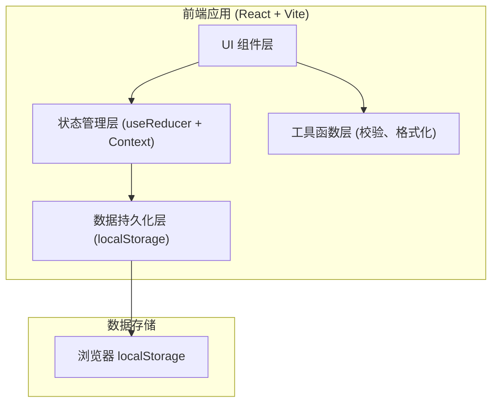
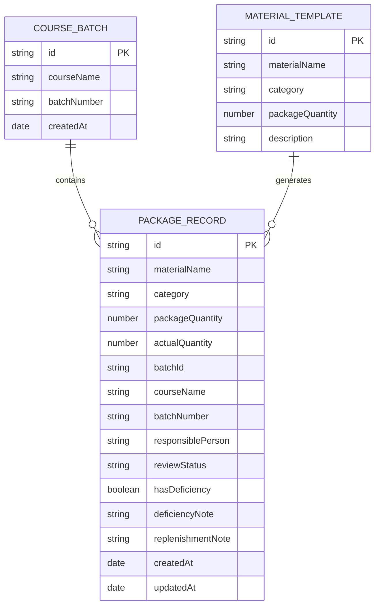

## 1. 架构设计



系统为纯前端单页应用，无后端服务。数据通过 localStorage 持久化存储，状态通过 React Context + useReducer 集中管理。

---

## 2. 技术栈说明

- **前端框架**：React@18
- **构建工具**：Vite@5
- **样式方案**：Tailwind CSS@3
- **状态管理**：React Context + useReducer
- **图标库**：Lucide React
- **数据持久化**：浏览器 localStorage
- **开发语言**：JavaScript (ES6+)

---

## 3. 路由定义

单页应用，使用状态切换代替路由：

| 视图 | 触发方式 | 说明 |
|------|----------|------|
| 主工作台 | 默认视图 | 记录列表、筛选、批量操作 |
| 批次管理弹窗 | 点击"批次管理"按钮 | 课程批次增删改 |
| 模板管理弹窗 | 点击"资料模板"按钮 | 资料模板维护 |
| 发放单预览 | 点击"发放单预览"按钮 | 只读发放清单 |

---

## 4. 数据模型

### 4.1 数据实体关系



### 4.2 localStorage 存储键

| 键名 | 数据类型 | 说明 |
|------|----------|------|
| `training_pkg_courses` | Array | 课程批次列表 |
| `training_pkg_templates` | Array | 资料模板列表 |
| `training_pkg_records` | Array | 分装记录列表 |
| `training_pkg_settings` | Object | 系统设置（当前角色等） |

### 4.3 枚举值

**复核状态 (reviewStatus)**：
- `pending` - 待复核
- `passed` - 已通过
- `failed` - 有缺漏

**资料类别 (category)**：
- `handout` - 讲义资料
- `worksheet` - 练习册
- `certificate` - 证书类
- `supplies` - 文具用品
- `other` - 其他

---

## 5. 核心模块设计

### 5.1 状态管理结构

```
state = {
  records: [...],        // 分装记录
  courses: [...],        // 课程批次
  templates: [...],      // 资料模板
  filters: {             // 当前筛选条件
    courseName: '',
    category: '',
    reviewStatus: '',
    responsiblePerson: '',
    hasDeficiency: null
  },
  currentRole: 'manager',// 当前角色
  expandedBatches: {},   // 展开的批次（用于折叠查看）
  selectedIds: [],       // 已选中的记录ID
  ui: {
    showBatchModal: false,
    showTemplateModal: false,
    showPreview: false,
    editingRecord: null
  }
}
```

### 5.2 核心校验函数

| 函数名 | 输入 | 输出 | 说明 |
|--------|------|------|------|
| `validateBatchDuplicate` | batchNumber, courseName, records | boolean | 检查批次号是否重复 |
| `validateQuantity` | actualQty, packageQty | boolean | 检查实际数量是否充足 |
| `validateDeficiencyNote` | hasDeficiency, note | boolean | 检查缺漏说明是否填写 |
| `validateStatusConsistency` | reviewStatus, hasDeficiency | boolean | 检查状态与缺漏一致性 |
| `validateWorkload` | person, records | boolean | 检查负责人任务量 |
| `runAllValidations` | record, records | Array<{type, message}> | 运行全部校验并返回问题列表 |

### 5.3 组件拆分

| 组件路径 | 职责 |
|----------|------|
| `src/App.jsx` | 根组件，状态管理容器 |
| `src/components/Header.jsx` | 顶部导航、角色切换 |
| `src/components/StatsCards.jsx` | 统计概览卡片 |
| `src/components/FilterBar.jsx` | 筛选工具栏 |
| `src/components/RecordTable.jsx` | 记录表格（含折叠） |
| `src/components/RecordRow.jsx` | 单行记录（含行内编辑） |
| `src/components/BatchModal.jsx` | 批次管理弹窗 |
| `src/components/TemplateModal.jsx` | 模板管理弹窗 |
| `src/components/PreviewModal.jsx` | 发放单预览弹窗 |
| `src/components/BatchActions.jsx` | 批量操作栏 |
| `src/hooks/useLocalStorage.js` | localStorage 持久化 Hook |
| `src/utils/validation.js` | 校验工具函数 |
| `src/utils/helpers.js` | 通用工具函数 |
| `src/data/mockData.js` | 初始示例数据 |

---

## 6. 性能与体验优化

1. **数据持久化防抖**：state 变更后延迟 300ms 写入 localStorage，避免频繁 IO
2. **列表虚拟滚动**：记录超过 100 条时启用虚拟列表（按需实现）
3. **筛选记忆**：筛选条件保存到 localStorage，刷新后保留
4. **折叠状态记忆**：批次折叠/展开状态记忆
5. **批量操作优化**：使用 `requestAnimationFrame` 分批更新大量记录
